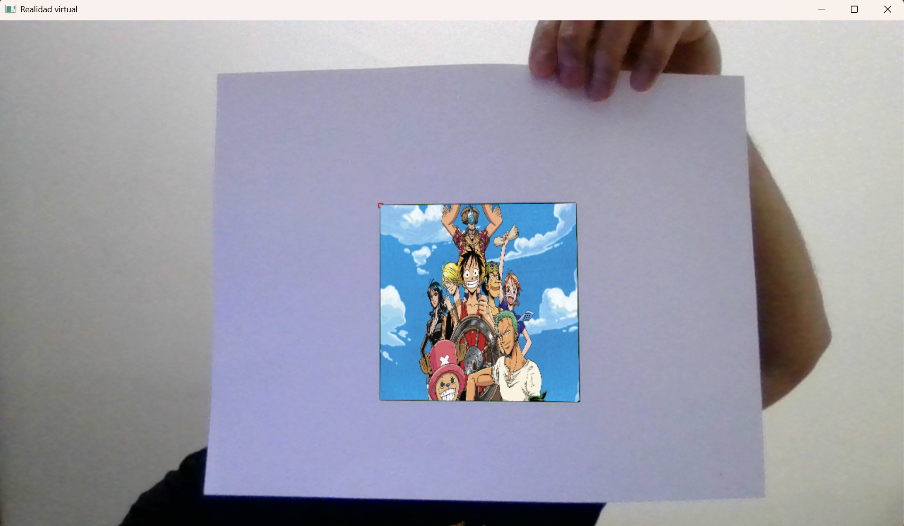
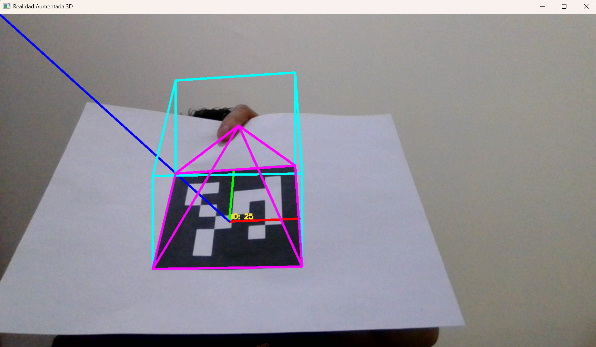

# 🔳 ArUco Markers: 2D & 3D Computer Vision

A comprehensive specialized repository for the generation, detection, and 3D pose estimation of **ArUco markers**. This project explores applications from basic 2D identification to advanced 3D spatial positioning using **OpenCV** and **Python**.


---

## 🎯 Project Overview

ArUco markers are binary square fiducial markers used for camera pose estimation. This repository provides a structured approach to implementing these markers in various environments:

* **2D Processing:** Marker generation, dictionary selection, and robust identification in image streams.
* **3D Applications:** Camera calibration, PnP (Perspective-n-Point) algorithms, and real-time pose estimation ($X, Y, Z$ and rotations).

## 📸 Screenshots

<p align="center">
    
    
</p>

## 📁 Project Structure

```text
ArUco/
├── 📂 2D/          # Marker generation and basic detection scripts.
└── 📂 3D/          # Pose estimation, camera calibration, and AR.
```

## 🚀 Getting Started

### Prerequisites

* **Python 3.x**
* **OpenCV contrib** (required for ArUco modules):

  ```bash
  pip install opencv-python numpy
  ```

### Installation

1. Clone the repository:

````bash
git clone https://github.com/CarlosM1024/ArUco.git]

cd ArUco
````

2. Camera Calibration (For 3D): Before using the 3D scripts, ensure you calibrate your camera following the [README.md](https://github.com/CarlosM1024/ArUco/tree/main/2D/README.md) in 3D/.

## 🛠️ Usage

### 2D Detection

Navigate to the 2D folder and run the detection script:

````Bash
python 2D/Detect_Aruco_2D.py
````

### 3D Pose Estimation

To visualize the 3D axis on a detected marker:

````Bash
python 3D/Detect_Aruco_3D.py
````

## 📄 License

This project is licensed under the MIT License - see the [LICENSE](LICENSE) file for details.

## 🤝 Contributing

If you'd like to contribute to this project, feel free to submit a pull request. Please make sure your code follows the existing style and includes appropriate comments.

1. Fork the repository.
2. Create a new branch for your feature or bug fix.
3. Commit your changes.
4. Push to the branch.
5. Submit a pull request.

## 👤 Author

**Carlos Antonio Martinez Miranda**

GitHub: [@CarlosM1024](https://github.com/CarlosM1024)
